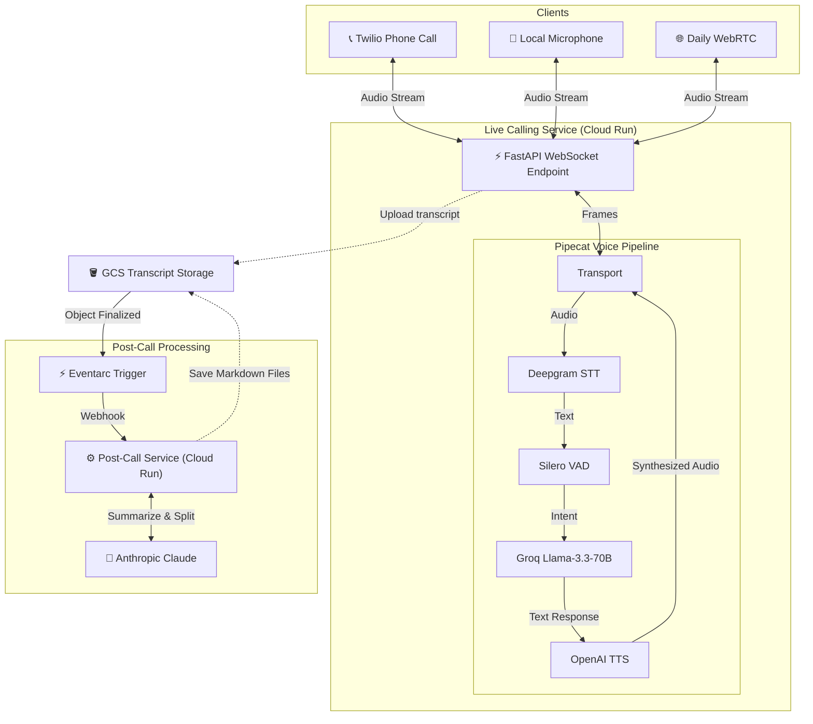
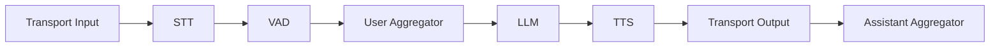
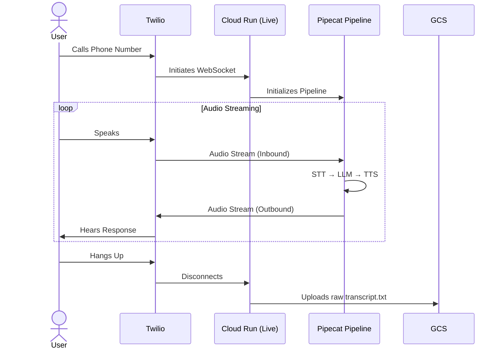
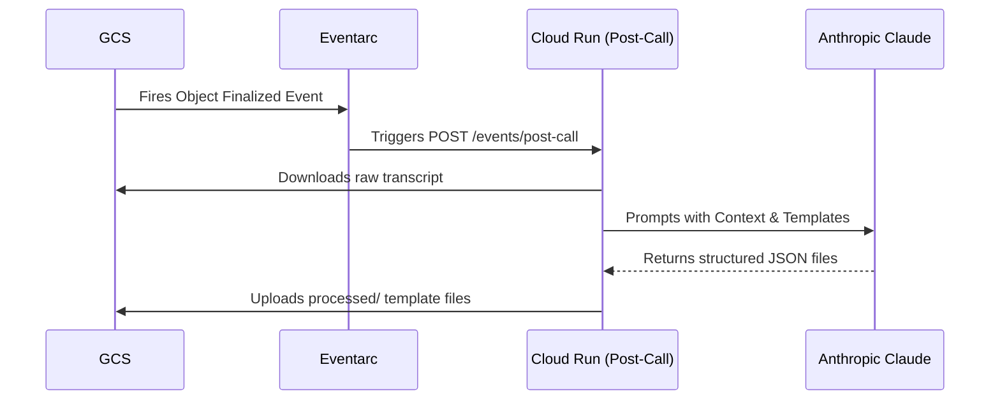
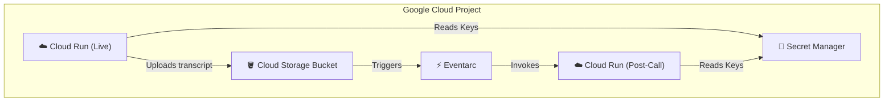

# GhostBrain Architecture

## Overview

GhostBrain is a real-time voice AI virtual assistant that conducts natural conversations through phone calls or local microphone. It combines state-of-the-art speech recognition, language understanding, and voice synthesis to create a seamless conversational experience. Crucially, it decouples live caller latency from post-call analysis by utilizing an event-driven serverless architecture.

## System Architecture

## Core Components

### 1. **Input Layer**
The system accepts audio input from multiple sources:

- **Twilio WebSocket**: Production phone calls via Twilio Media Streams
  - 8kHz sample rate (telephony standard)
  - µ-law audio encoding
  - Real-time bidirectional streaming

- **Local Microphone**: Development/testing via PyAudio
  - 16kHz sample rate (higher quality)
  - Direct PCM audio capture
  - No telephony overhead

### 2. **Live Service (FastAPI)**
Central web application managing active WebSocket connections:

- **Endpoint**: `/ws` - Accepts Twilio Media Stream connections
- **Async Architecture**: Full async/await pattern for concurrent connections
- **Transcript Upload**: Uploads the raw text transcript to GCS immediately upon call hangup.

### 3. **Pipecat Pipeline**
The heart of the live system - a composable pipeline for real-time voice processing:

### 4. **Voice Activity Detection (VAD)**
**Model**: Silero VAD
- Detects when users start/stop speaking
- Configurable pause detection (0.2-0.5 seconds)
- Prevents interruptions and crosstalk

### 5. **Speech-to-Text (STT)**
**Service**: Deepgram
**Model**: `nova-2`
- Industry-leading accuracy for conversational speech
- Real-time streaming transcription (<300ms latency)

### 6. **Large Language Model (LLM)**
**Service**: Groq
**Model**: `llama-3.3-70b-versatile`
- Ultra-fast inference (Groq LPU architecture) optimized for <200ms TTFT (Time to First Token) to keep conversations natural.

### 7. **Text-to-Speech (TTS)**
**Service**: OpenAI
**Model**: `tts-1`
**Voice**: `alloy`
- Natural-sounding synthesized speech optimized for latency.

### 8. **Post-Call Processing (Eventarc & Anthropic)**
To prevent heavy processing from stealing CPU cycles from live callers, analysis is handled by a separate Cloud Run service:

- **Eventarc**: Listens for file drops in the GCS bucket.
- **Anthropic Claude 3.5 Sonnet**: Analyzes the raw transcript, intelligently splits the user's thoughts into multiple topics, and formats them into beautiful Markdown using predefined templates (e.g. Daily Logs, Project Ideas).
- **Storage Loop**: The generated markdown files are saved back into the `processed/` prefix of the GCS bucket.

## Data Flow

### Live Phone Call Flow

### Post-Call Async Flow

## Deployment Architecture

### Google Cloud Platform

**Infrastructure as Code**: Terraform manages all GCP resources natively, automatically provisioning the Eventarc triggers, Pub/Sub permissions, and binding Secret Manager versions to the Cloud Run services.

## Performance Characteristics

### Latency Budget (Live Service)
- **STT Latency**: ~200-300ms (Deepgram streaming)
- **LLM Latency**: ~100-200ms (Groq LPU)
- **TTS Latency**: ~150-250ms (OpenAI streaming)
- **Network**: ~50-100ms
- **Total End-to-End**: ~500-850ms

### Scalability
- **Decoupled Workloads**: By moving LLM analysis and JSON parsing to a secondary `Post-Call` Cloud Run service, the `Live` service maintains real-time WebSocket stability without CPU starvation.
