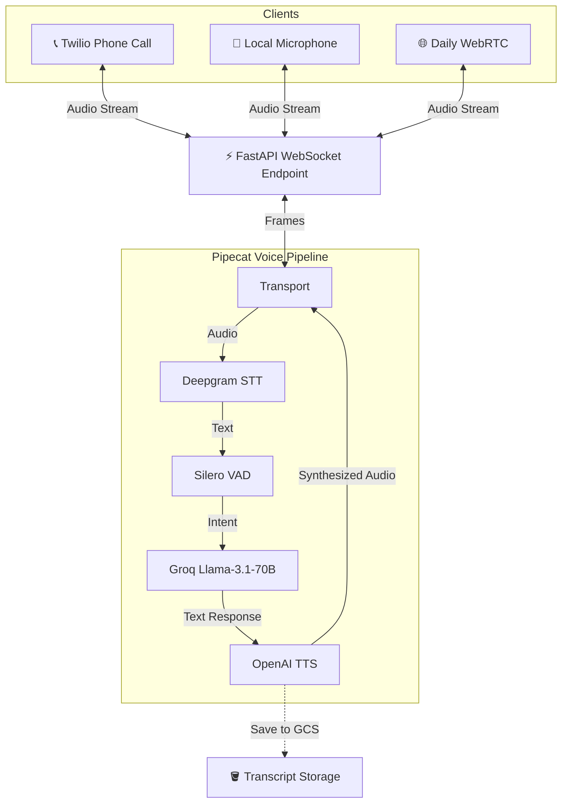
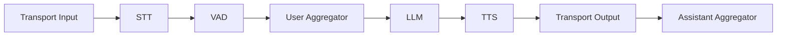
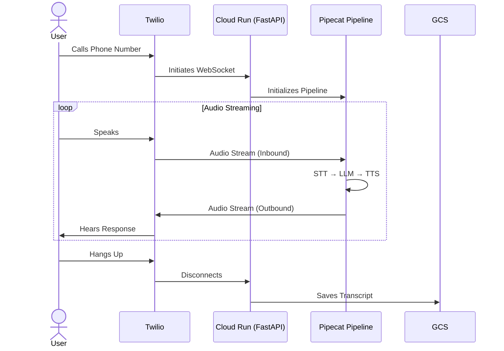
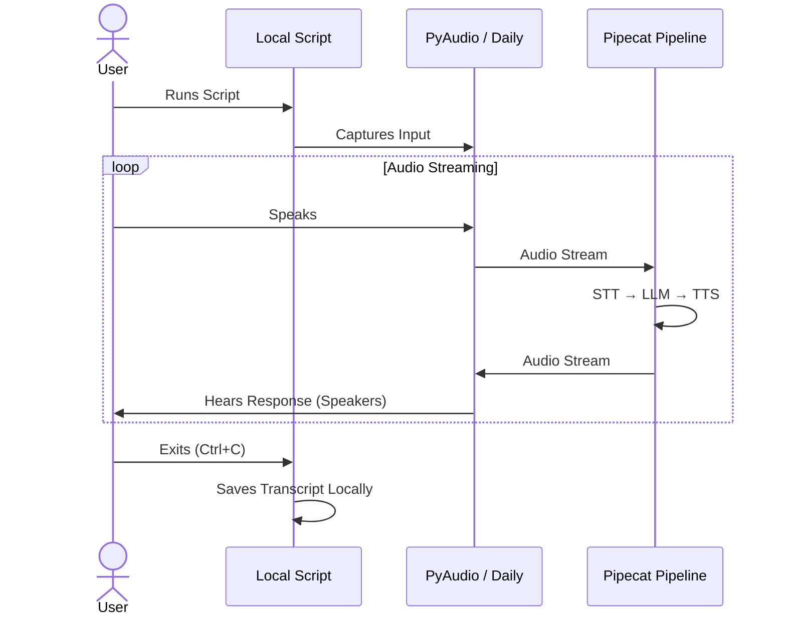
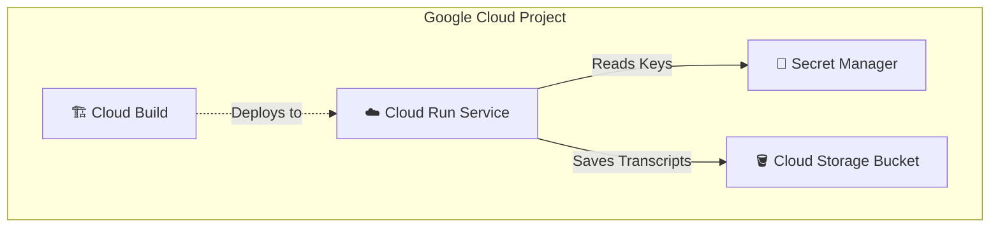

# GhostBrain Architecture

## Overview

GhostBrain is a real-time voice AI interviewer bot that conducts natural conversations through phone calls or local microphone. It combines state-of-the-art speech recognition, language understanding, and voice synthesis to create a seamless conversational experience.


## System Architecture



## Core Components

### 1. **Input Layer**
The system accepts audio input from multiple sources:

- **Twilio WebSocket**: Production phone calls via Twilio Media Streams
  - 8kHz sample rate (telephony standard)
  - µ-law audio encoding
  - Real-time bidirectional streaming

- **Local Microphone**: Development/testing via PyAudio
  - 16kHz sample rate (higher quality)
  - Direct PCM audio capture
  - No telephony overhead

- **Daily WebRTC**: Browser-based testing
  - 16kHz sample rate
  - WebRTC peer-to-peer connection
  - Shareable room URLs for collaboration

### 2. **FastAPI Application**
Central web application managing WebSocket connections:

- **Endpoint**: `/ws` - Accepts Twilio Media Stream connections
- **Health Check**: `/health` - For load balancer/Cloud Run monitoring
- **Async Architecture**: Full async/await pattern for concurrent connections
- **Session Management**: Tracks call sessions and manages cleanup

### 3. **Pipecat Pipeline**
The heart of the system - a composable pipeline for real-time voice processing:



Each component processes audio/text frames in real-time:

- **Frames**: Atomic units of data (audio chunks, text, control signals)
- **Streaming**: Continuous processing without waiting for complete utterances
- **Backpressure**: Automatic flow control to prevent overwhelming any component

### 4. **Voice Activity Detection (VAD)**
**Model**: Silero VAD
- Detects when users start/stop speaking
- Configurable pause detection (0.2-0.5 seconds)
- Prevents interruptions and crosstalk
- Filters background noise

### 5. **Speech-to-Text (STT)**
**Service**: Deepgram
**Model**: `nova-2`
- Industry-leading accuracy for conversational speech
- Real-time streaming transcription
- Low latency (<300ms)
- Automatic punctuation and capitalization
- Speaker diarization capable

### 6. **Large Language Model (LLM)**
**Service**: Groq
**Model**: `llama-3.3-70b-versatile`
- 70 billion parameter model
- Optimized for conversational AI
- Ultra-fast inference (Groq LPU architecture)
- Context window: 8,192 tokens
- System prompt customization for interviewer personality

### 7. **Text-to-Speech (TTS)**
**Service**: OpenAI
**Model**: `tts-1`
**Voice**: `alloy`
- Natural-sounding synthesized speech
- Low latency streaming
- Consistent voice characteristics
- Clear articulation for phone audio

### 8. **Context Management**
LLM Context tracks conversation history:
- User utterances
- Assistant responses
- Maintains conversation flow
- Enables follow-up questions
- Powers transcript generation

### 9. **Storage Layer**
**Google Cloud Storage** for persistent data:
- Call transcripts saved as text files
- Organized by date and session ID
- Automatic retention policies
- Integration with BigQuery for analytics

## Data Flow

### Phone Call Flow (Production)


### Local Testing Flow


## Deployment Architecture

### Google Cloud Platform



**Cloud Run**: Serverless container platform
- Auto-scaling (0 to N instances)
- HTTPS endpoint with managed SSL
- WebSocket support
- Pay-per-use pricing

**Secret Manager**: Secure credential storage
- API keys for Deepgram, Groq, OpenAI, Twilio
- Automatic rotation support
- IAM-based access control

**Cloud Storage**: Object storage for transcripts
- High durability (99.999999999%)
- Lifecycle management
- Cross-region replication option

**Cloud Build**: CI/CD pipeline
- Triggered on GitHub push
- Builds Docker container
- Deploys to Cloud Run
- Zero-downtime deployments

### Infrastructure as Code

**Terraform** manages all GCP resources:
```hcl
modules/
├── cloud_run/     # Service configuration
├── storage/       # GCS bucket setup
├── secrets/       # Secret Manager
├── iam/          # Service accounts & permissions
└── monitoring/   # Logging & alerting
```

## Performance Characteristics

### Latency Budget
- **STT Latency**: ~200-300ms (Deepgram streaming)
- **LLM Latency**: ~100-200ms (Groq LPU)
- **TTS Latency**: ~150-250ms (OpenAI streaming)
- **Network**: ~50-100ms (depends on geography)
- **Total End-to-End**: ~500-850ms

### Scalability
- **Concurrent Calls**: Limited by Cloud Run instance count
- **Max Instance Count**: Configurable (default: 100)
- **Instance Capacity**: ~10-20 concurrent WebSockets per instance
- **Cold Start**: ~2-3 seconds (container initialization)

### Cost Optimization
- **Cloud Run**: Pay only for active call time
- **Minimum Instances**: 0 (scales to zero)
- **CPU Allocation**: Only during request processing
- **Storage**: Minimal (text transcripts only)

## Security Model

### Authentication & Authorization
- **Twilio Signature Validation**: Verifies webhook authenticity
- **API Key Management**: All keys in Secret Manager
- **Service Account**: Minimal GCP permissions
- **Network Security**: HTTPS/WSS only

### Data Privacy
- **No Audio Recording**: Only transcripts saved
- **Encryption**: TLS in transit, AES-256 at rest
- **Data Retention**: Configurable lifecycle policies
- **PII Handling**: No automatic PII detection (can be added)

## Monitoring & Observability

### Logging
- **Application Logs**: Structured JSON to Cloud Logging
- **Access Logs**: HTTP/WebSocket requests
- **Error Tracking**: Exception stack traces
- **Performance Metrics**: Latency, throughput

### Health Checks
- **/health endpoint**: Simple liveness check
- **Cloud Run Probes**: Automatic restart on failure
- **Uptime Monitoring**: External synthetic checks

## Development Workflow

### Local Development
1. **Environment Setup**: Python 3.12, Hatch, pre-commit
2. **Local Testing**: PyAudio or Daily transport
3. **Unit Tests**: Pytest with mocked services
4. **Integration Tests**: Against real APIs (dev keys)

### CI/CD Pipeline
1. **Pre-commit Hooks**: Ruff linting/formatting
2. **GitHub Actions**: Test on push
3. **Cloud Build**: Build and deploy on main
4. **Terraform**: Infrastructure updates

## Model Selection Rationale

### Why These Models?

**Deepgram Nova-2 (STT)**
- Best accuracy for conversational speech
- Excellent background noise handling
- Fast streaming capability
- Cost-effective at scale

**Llama 3.1 70B via Groq (LLM)**
- Open-source model (no vendor lock-in)
- Groq's LPU delivers fastest inference
- Large enough for complex reasoning
- Excellent instruction following

**OpenAI TTS-1 (TTS)**
- Most natural-sounding voices
- Reliable streaming API
- Good phone audio quality
- Reasonable pricing

**Silero VAD**
- Lightweight and fast
- Works well at 8kHz and 16kHz
- Open-source
- No API dependency

## Future Enhancements

### Planned Features
- **Multi-language Support**: Expand beyond English
- **Custom Voices**: Clone specific voice characteristics
- **Sentiment Analysis**: Real-time emotional understanding
- **Call Analytics**: Conversation insights and metrics
- **Web Interface**: Browser-based calling option

### Potential Optimizations
- **Edge Deployment**: Run VAD/STT closer to users
- **Model Fine-tuning**: Custom models for specific domains
- **Caching**: Reduce repeated LLM calls
- **Batching**: Process multiple streams efficiently
